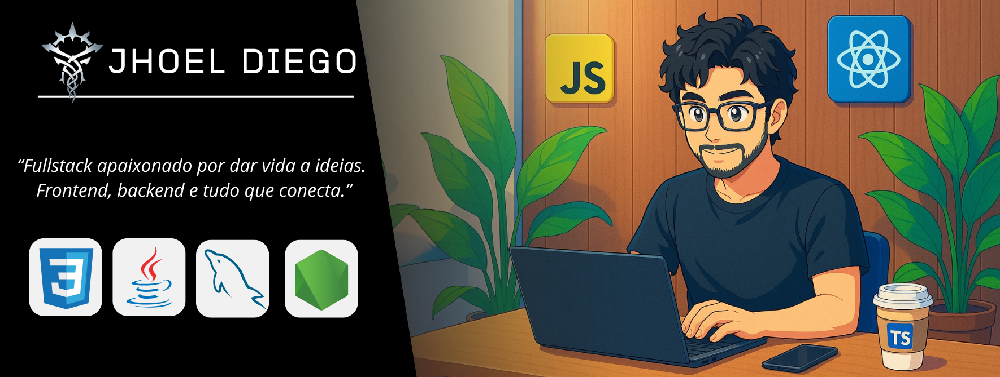
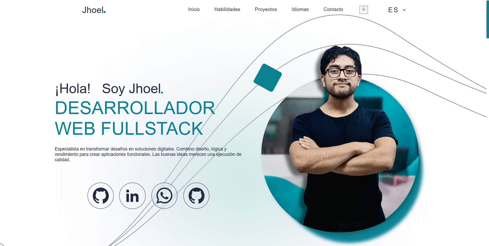
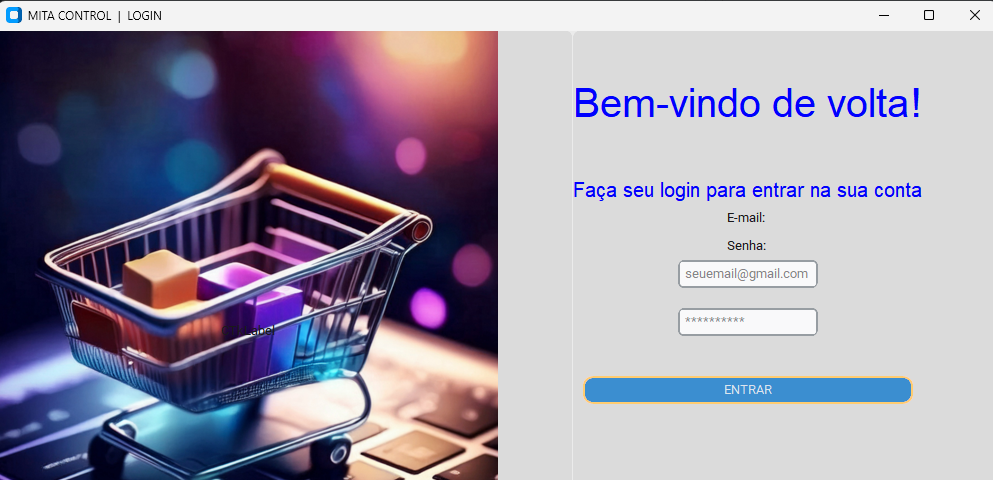

<!--  -->
  

<h3 align="center">
  Desenvolvedor Fullstack • Estudante Sistemas da Informação
</h3>

  
  

 

<strong>Sobre mim</strong>

-  Olá! Meu nome é Jhoel Diego e eu sou um Desenvolvedor FullStack cursando Sistemas da Informação...
 
-  Meu objetivo atual é me tornar um desenvolver FullStack e Poliglota. 
- Minha stack principal é Javasript, React e Typescript. 
 
-  Eu sempre trato de ser o mais responavel e respeitoso, e eu gosto de intercambiar ideas a fim de aprender mais
 
-  Cursando o 2 semestre de Sistemas da Informação na Sptech School.

## &nbsp;Minha Stack

## Idiomas  

   
  
     
  
     
  

#

  
<strong>Entre em contato comigo</strong>

  
       
     

 ## Projetos 

 

