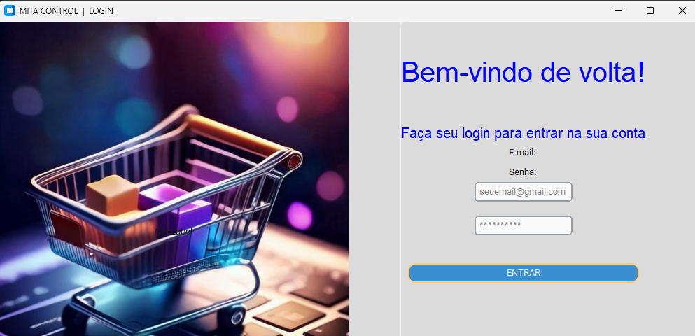

  

<h3 align="center">
  Estagiário em Arquitetura de Soluções • Banco Bradesco
</h3>

 

<strong>Sobre mim</strong>

-  
 &nbsp;&nbsp; Olá! Sou Jhoel Diego, atuando hoje como Estagiário de Arquiteto de Soluções na Tribo Core de um grande banco.

-  
 &nbsp;&nbsp; Meu foco atual é arquitetura de software, engenharia de plataforma e backend corporativo escalável. 

-  
 &nbsp;&nbsp;Minha base técnica é focada em Java (Spring Boot), Python, Javascript, Azure, AWS, Docker e Design Patterns.  

-  
 &nbsp;&nbsp; Tenho vivência prática com documentação arquitetural (ADRs), modelagem de APIs REST e microsserviços. 

-  
 &nbsp;&nbsp; Estudante de Sistemas da Informação na SPtech - São Paulo Tech School.

## &nbsp;Minhas Ferramentas e Tecnologias

## Idiomas  

   
  
     
  
     
  

 

<strong>Entre em contato comigo</strong>

  
       
     

## Projetos

