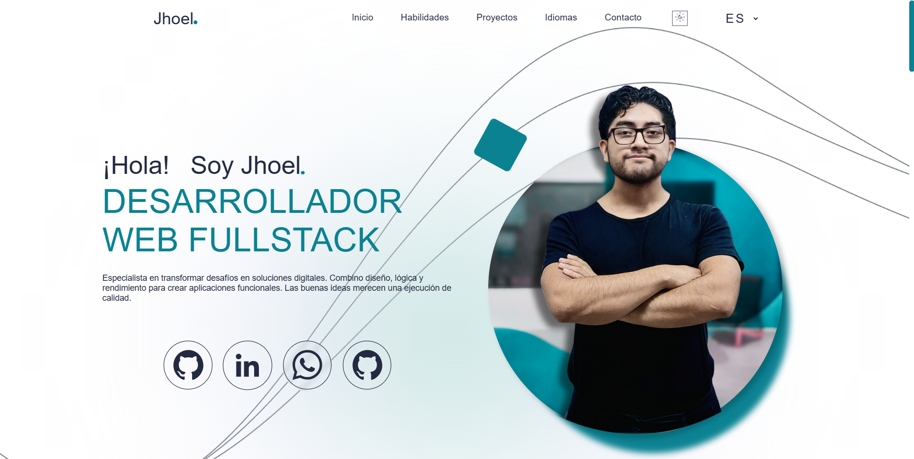

  

<h3 align="center">
  Estagiário em Arquitetura de Soluções • Banco Bradesco
</h3>

 

<strong>Sobre mim</strong>

-  
 &nbsp;&nbsp; Olá! Sou <strong>Jhoel Mita</strong>, boliviano, 20 anos e residente no Brasil há 5 anos.

-  
 &nbsp;&nbsp; Atuo como Estagiário de Arquiteto de Soluções na Tribo Core do Bradesco.

-  
 &nbsp;&nbsp; Meu objetivo é aprender e evoluir minhas competências para me tornar Arquiteto Júnior.

-  
 &nbsp;&nbsp; Meu foco atual é arquitetura de software, engenharia de plataforma e backend corporativo escalável. 

-  
 &nbsp;&nbsp; Minha base técnica é focada em Java (Spring Boot), Python, Javascript, Azure, AWS, Docker e Design Patterns. 

-  
 &nbsp;&nbsp; Tenho vivência prática com documentação arquitetural (ADRs), modelagem de APIs REST e microsserviços. 

-  
 &nbsp;&nbsp; Estudante de Sistemas da Informação na SPtech - São Paulo Tech School.

## &nbsp;Minhas Ferramentas e Tecnologias

## Idiomas  

   
  
     
  
     
  

 

<strong>Entre em contato comigo</strong>

  
       
     

## 👥 Projetos em Grupo

<table width="100%">
  <tr>
    <td width="45%" align="center">
      
    </td>
    <td width="70%">
      <b>Título:</b> LOFHEL 
      <b>Arquitetura:</b> Monolítica (Foco em IoT) 
      <b>Stack:</b> Node.js, JavaScript, HTML5, CSS3, MySQL 
      <b>Destaques Técnicos:</b>
      <ul>
        <li>Monitoramento de sensores em tempo real</li>
        <li>Autenticação de usuários e níveis de acesso</li>
        <li>Integração de hardware com coleta de dados via sensores</li>
        <li>Dashboard dinâmico para visualização de métricas</li>
      </ul>
    </td>
  </tr>

  <tr>
    <td width="45%" align="center">
      
    </td>
    <td width="70%">
      <b>Título:</b> OBERON 
      <b>Arquitetura:</b> Monolítica (Foco em Análise de dados) 
      <b>Stack:</b> Node.js, JavaScript, SQL Server, Slack API, AWS 
      <b>Destaques Técnicos:</b>
      <ul>
        <li>Monitoramento de performance de hardware e sistemas</li>
        <li>Análise preditiva utilizando Inteligência Artificial</li>
        <li>Geração automática de logs de aplicação para auditoria</li>
        <li>Integração com Slack para alertas críticos em tempo real</li>
        <li>Deploy em um ambiente nuvem da aws</li>
      </ul>
    </td>
  </tr>
</table>

## 🚀 Projetos Pessoais

<table width="100%">
  <tr>
    <td width="45%" align="center">
      
    </td>
    <td width="70%">
      <b>Título:</b> Shadow Slave 
      <b>Arquitetura:</b> Monolítica (Web Content) 
      <b>Stack:</b> Node.js, JavaScript, CSS3, HTML5 
      <b>Destaques Técnicos:</b>
      <ul>
        <li>Landing page promocional com design focado em UI/UX</li>
        <li>Implementação de mini-games temáticos em Vanilla JS</li>
        <li>Otimização de assets e identidade visual</li>
      </ul>
    </td>
  </tr>

  <tr>
    <td width="45%" align="center">
      
    </td>
    <td width="70%">
      <b>Título:</b> Portfólio Pessoal 
      <b>Arquitetura:</b> SPA (Single Page Application) 
      <b>Stack:</b> React, TypeScript, Vite, Styled-Components 
      <b>Destaques Técnicos:</b>
      <ul>
        <li>Componentização avançada e código altamente reutilizável</li>
        <li>Suporte nativo a Dark/Light Mode</li>
        <li>Integração com APIs de e-mail (Contact Form)</li>
        <li>Design focado em performance e SEO</li>
      </ul>
    </td>
  </tr>

  <tr>
    <td width="45%" align="center">
      
    </td>
    <td width="70%">
      <b>Título:</b> Extreme Go Horse 
      <b>Arquitetura:</b> Client-side Application 
      <b>Stack:</b> JavaScript (Vanilla), HTML5, CSS3 
      <b>Destaques Técnicos:</b>
      <ul>
        <li>Manipulação intensiva do DOM em tempo real</li>
        <li>Lógica de ranqueamento e estados de pódio dinâmicos</li>
        <li>Foco em agilidade de funcionalidades e lógica visual</li>
      </ul>
    </td>
  </tr>

  <tr>
    <td width="45%" align="center">
      
    </td>
    <td width="70%">
      <b>Título:</b> Conversor de Bases Numéricas 
      <b>Arquitetura:</b> Static Web App 
      <b>Stack:</b> JavaScript, HTML5, CSS3 
      <b>Destaques Técnicos:</b>
      <ul>
        <li>Algoritmos de conversão (Binário, Octal, Decimal, Hexadecimal)</li>
        <li>Interface intuitiva para manipulação matemática</li>
        <li>Validação de entrada de dados para garantir integridade</li>
      </ul>
    </td>
  </tr>
</table>